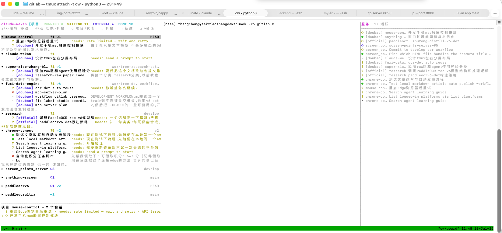
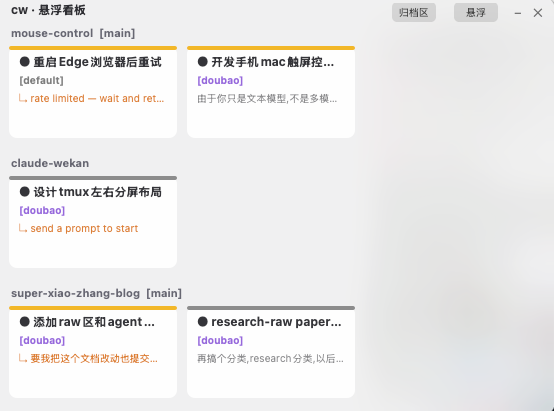

# claudemux

> A tmux-native dashboard for your many Claude Code sessions. See every running
> Claude at a glance, switch between them in one keystroke, and never lose track
> of which project is waiting on you.

`claudemux` (command: `cw`) gathers every Claude Code session you have running
into one tmux session. Each session lives in a window split
`[ board 30% │ conversation 55% │ services 15% ]` — the board stays visible on the
left, your conversation in the middle, and listening backends as `port-project`
on the right. You always know which session is busy, idle, blocked on a question,
or done — and which local ports each project is serving — without leaving tmux.



**Three-pane terminal layout** — the board (left) shows every session's status at
a glance, the conversation (center) is where you talk to Claude, and the services
panel (right) lists listening ports as `port-project-name` (project or all-machine).



**Floating HUD (macOS)** — `cw hud` opens a native always-on-top panel that mirrors
the board as card tiles, so you get the overview without keeping a terminal in
view. Sessions are grouped by project, colored by status, and tagged with their
config label (e.g. `[doubao]`).

## Why

Run more than one Claude at a time and you quickly lose track: *which terminal
was the API server, which one is waiting for me to confirm, which one already
finished?* `claudemux` turns that chaos into a single screen — and the terminal
stays front and center, because the terminal is where the real work happens.

## Features

- **One-screen overview** — every live Claude session, grouped by status.
- **"Waiting (needs you)"** — surfaces sessions blocked on a question, with the
  actual question shown inline. This is the painkiller.
- **Three-pane layout** — board (30%), conversation (55%), services panel (15%).
  The board and services stay visible in every window; only the keyboard focus
  moves between them.
- **Port radar** — right pane shows live backends as `port-project-name`, with a
  one-key toggle between Claude-project ports and all machine ports.
- **Instant switching** — select a card, land in that conversation. The board
  stays put on the left, so you never lose the overview.
- **Import existing sessions** — `claude --resume <sid>` pulls a bare-terminal
  session into tmux without losing the conversation history.
- **Launch new ones** — pick a project, optional first prompt, done.
- **Live status** — busy/idle, current task, todo progress (`TodoWrite`), last
  message, git branch, age — all read from the transcript.
- **Floating HUD (macOS)** — `cw hud` opens a native always-on-top panel with the
  same overview as card tiles, independent of any terminal window. Auto-launches
  with `cw up`.
- **Zero dependencies** — pure Python 3 stdlib + tmux. No pip, no npm.
  (The optional `cw hud` panel additionally needs PyObjC.)

## Requirements

- macOS or Linux
- tmux ≥ 3.0
- Python 3.8+
- Claude Code CLI (`claude`) on your PATH

## Install

```sh
git clone https://github.com/askxiaozhang/claudemux.git
cd claudemux
chmod +x cw.py
echo "alias cw='python3 $PWD/cw.py'" >> ~/.zshrc   # or ~/.bashrc
```

## Quick start

```sh
cw up        # create/attach the tmux session, bind hotkeys, and auto-launch HUD
```

Then, anywhere inside the `cw` session:

- `Ctrl-b b` — focus / summon the board pane (the left panel)
- `Ctrl-b B` — focus the conversation pane (cycles to the next split when several are pinned)
- `Ctrl-b s` — focus the services pane (the right panel)
- `Ctrl-b g` — toggle services view: **project ports** ↔ **all machine ports**
- `Ctrl-b h` — launch / focus the floating HUD ("钉看板")
- `Ctrl-b ←` / `Ctrl-b →` — move focus between panes (tmux default)
- `Ctrl-b z` — zoom the active pane to full width, again to restore
- `Ctrl-b N` — new Claude in a project (prompts for cwd)
- `Ctrl-b V` - unpin the conversation pane currently in focus

### Pinning multiple conversations side-by-side (y-axis split)

The center conversation area can be split into several side-by-side panes, each
running a different live session, so you can watch several at once. Switch focus
(`Ctrl-b B` cycles, or click) to type into any of them. Each pane gets a stable
color bar (derived from its session id) for at-a-glance distinction.

- (in the board) **click the dot** at the start of a card row to toggle pin:
  empty dot = not pinned, filled colored dot = pinned in the current window's center.
  Clicking pins the session into a side-by-side pane (not live -> split +
  `claude --resume`; live in another window -> closed there and resumed here;
  already here -> just focus it); clicking a pinned dot unpins (closes the pane,
  session stays on disk). The dot's color matches the pane's color bar.
- Keyboard aliases: `v` = pin selected card, `V` = unpin selected.
- `Ctrl-b V` - unpin whatever conversation pane currently has focus

One session id is live in at most one pane globally, so pinning never double-opens
a session. Panes auto-balance to equal width; beyond ~3 the columns get narrow.
## The board

The board is the left 30% of every window; the conversation takes the center 55%;
the services panel occupies the right 15%. All three panes are always visible —
`Ctrl-b b` / `Ctrl-b B` / `Ctrl-b s` just move the keyboard focus between them.

### Two levels: project and status

Sessions have two axes — **which project** they belong to, and **what status**
they're in (running / waiting / external / done). The board shows both, and you
pick which one is the top level:

- **Project view** (default) — one row per project, with a status roll-up
  (`● 1  ✓ 1`) and its git branch. Projects that have a session *waiting on you*
  sort to the top and expand automatically; the rest stay collapsed to one line.
  Expand/collapse a project with `Enter` / `Space` (or click its header); `z`
  toggles all at once.
- **Status view** — the classic grouping: `RUNNING`, `WAITING (needs you)`,
  `EXTERNAL`, `DONE`, each session tagged with its project name.

Press **`g`** to flip between the two. Your selection is preserved across the
switch and across refreshes.

**Mouse works too** (`cw up` turns it on for the `cw` session only):

- **Click a project header** → collapse / expand it.
- **Click** a card → select it (its detail shows below).
- **Click the selected card again**, or **double-click** any card → open it
  (switch to that window / import / reply).
- **Scroll wheel** → move the selection up and down.

Keyboard:

| Key | Action |
|---|---|
| `↑` `↓` / `j` `k` / scroll | move selection (over cards and project headers) |
| `g` | toggle project view ↔ status view |
| `Enter` / `Space` | project header → collapse/expand · card → switch / import / reply |
| `z` | collapse / expand all projects |
| `n` | new Claude session (cwd + optional prompt) |
| `i` | import the selected external session |
| `r` | refresh |
| `q` | focus the conversation pane (board stays visible) |

Status groups:

- **Running** — busy interactive sessions and running background agents
- **Waiting (needs you)** — idle sessions and blocked background agents (the
  question is shown inline)
- **External (importable)** — Claude sessions in a bare terminal, not yet in tmux
- **Done** — completed background agents

The selected card's detail panel shows cwd, the full current task, todo list,
last message, and git branch. Selecting a collapsed project header instead shows
a summary of every session in that project.

## Services panel

The services panel is a narrow column on the right side (~15% of window width)
that lists **listening TCP backends** as `port-project-name` (e.g.
`7077-screen_points_server`). It runs as `cw services` and auto-refreshes.

Two views (shared across all windows via `~/.cw_services_mode`):

| View | What it shows |
|---|---|
| **project** (default) | Ports whose process cwd sits under a live Claude session project — the backends Claude likely started |
| **all** | All user-level listening ports on the machine (system daemons like ControlCenter/rapportd are hidden) |

Toggle with **`Ctrl-b g`** from anywhere in the session, or inside the panel:

| Key | Action |
|---|---|
| `g` / `Tab` | project ↔ all |
| `p` / `a` | jump to project / all |
| `↑` `↓` / `j` `k` | scroll |
| `r` | refresh now |
| `q` | focus the conversation pane |

The panel is glanceable and stays visible while you work in the conversation.

## Floating HUD (macOS)

`cw hud` opens a native, always-on-top panel that mirrors the board as card
tiles — grouped by project, colored by status, tagged with the `[config]` each
session belongs to. It runs as its own process and stays pinned on top of every
app, so you get the overview without keeping a terminal in view.

Requires PyObjC (`pip install pyobjc`); it's optional and only needed for `cw hud`.
The HUD auto-launches in the background when you run `cw up`.

The panel's toolbar (top-right) cycles and toggles:

- **悬浮 / 终端 / 并存** — a three-way mode cycle: HUD only → terminal only
  (HUD collapses to a title bar) → both side by side. In terminal/both modes the
  panel brings the terminal attached to the `cw` session to the front, or opens a
  new window with `tmux attach -t cw` if nothing is connected yet.
- **归档区 / 看板** — switch between the live board and the archive.
- **– / +** — minimize the panel to a title bar and back.
- **✕** — quit the HUD (also `Esc`, `q`, or `Ctrl-C`).

Interactions:

- **Click** a tile to switch to that session's tmux window and bring the terminal
  forward.
- **Drag** the title bar to move the panel; drag an edge to resize.
- **Right-click** a tile → **归档 / 取消归档** to archive or unarchive that
  session. Archived sessions are hidden from the board and kept under the archive
  view; archiving is stored by `sessionId` in `~/.cw_archived.json` and persists
  across restarts.

## Commands

```
cw                         create/attach tmux session + bind keys (default)
cw up                      same as above (also auto-launches HUD)
cw board                   run the board TUI directly
cw services                run the services panel TUI (port-project list)
cw services-toggle         flip project ports ↔ all ports (Ctrl-b g)
cw launch <cwd> [prompt] [--config doubao|official]   open a new Claude window in <cwd>
cw import <sid>            import an existing session via claude --resume
cw pin <sid>              pin a session into the current window's center (split/resume)
cw unpin <sid8|current>   unpin a session (by sid8, or 'current' for the focused pane)
cw pane board|claude|services   focus/summon a specific pane in the current window
cw hud                     floating macOS "钉看板" panel (needs PyObjC; focuses if already open)
cw list [--by project|status]  print the board as plain text (no TUI)
cw status                  print discovered sessions/jobs as JSON
```

## How it works

`claudemux` only **reads** files Claude already writes — it doesn't patch or
wrap the CLI:

| Source | Read for |
|---|---|
| `sessions/<pid>.json` | live interactive sessions: pid, sessionId, cwd, busy/idle |
| `jobs/<id>/state.json` | background agents: state, the question it's blocked on, tokens |
| `projects/*/<sid>.jsonl` (tail) | session title, current task, last message, `TodoWrite` progress, git branch |
| `.claude.json` | known projects |

It scans `~/.claude-doubao`, `~/.claude-official` and `~/.claude`, dedupes by
`sessionId`, and remembers which config dir each session came from. tmux
windows are named `<project>-<sid8>`; the board uses that 8-char suffix to tell
switchable (in-tmux) sessions apart from external (bare-terminal) ones — no
process-tree walking required.

**Config-aware launch/resume.** If you run Claude through multiple
`CLAUDE_CONFIG_DIR` profiles (e.g. `ccdoubao=CLAUDE_CONFIG_DIR=~/.claude-doubao
claude`), the board tags each card with its config (`[doubao]`, `[official]`, …)
and always relaunches/resumes with the matching `CLAUDE_CONFIG_DIR` — so
importing or replying to a session never switches you to the wrong model.
`cw launch` takes `--config <label>` and the board's **new-session** prompt lets
you pick the config when more than one profile exists.

```
   ┌─────────────────── tmux session "cw" ──────────────────────┐
   │  every window:  [ board 30% │ conversation 55% │ ports 15% ] │
   │                                                             │
   │  win api-server-3a305475                                    │
   │   ┌─board─────┬─conversation──────────┬─ports────────┐      │
   │   │RUNNING (1)│ $ claude               │端口[项目] 4  │      │
   │   │▸ ● api-srv│ > deploying to…        │7077-api-srv  │      │
   │   │WAITING (1)│                        │3000-web-app  │      │
   │   │  ? web-app│                        │5173-web-app  │      │
   │   └───────────┴────────────────────────┴──────────────┘      │
   │  win web-app-0702e324    win docs-4966e175    …             │
   │   ▲ pick a card on the left → switch window                 │
   │     board + ports stay visible; Ctrl-b g toggles all/proj   │
   └─────────────────────────────────────────────────────────────┘
```

## Limitations

- **You can't attach to a bare terminal retroactively.** macOS (SIP) and tmux
  only let you manage sessions they started. Sessions already running in a plain
  terminal appear under **External** and are imported via `claude --resume`,
  which continues the conversation in a fresh tmux window.
- **After importing, close the old terminal.** `--resume` points the new tmux
  process at the same session; two writers can conflict.

## Troubleshooting

- **Clicking the pin dot / `v` just flashes, no pane appears** - `claude --resume`
  exited instantly, usually because `claude` isn't on PATH (a recent reinstall can
  leave only `claude.exe` with no symlink). `cw` auto-resolves the binary via
  `_claude_bin()` (PATH, then `claude.exe`, `~/.claude/local/claude`, npm global);
  check with `python3 -c "import cw;print(cw._claude_bin())"`. Re-run `cw up` after
  upgrading so the board picks up the fix.
- **The pin dot doesn't show / clicking it does nothing** - the board pane is old code;
  re-run `cw up` (respawns the board). Confirm `tmux show-option -t cw mouse` is `on`.
- **Pinning the current window's own session doesn't split** - correct, it's already
  here; select a *different* session's card and click its dot to split.
- **`Ctrl-b b` does nothing** — re-run `cw up` (it re-binds the key in the tmux
  prefix table). Run `tmux list-keys -T prefix | grep cw.py` to verify.
- **No board pane in this window** — `Ctrl-b b` creates one on the left if
  missing. Windows from before the latest `cw up` get a board pane on first
  `Ctrl-b b`.
- **No services pane in this window** — `Ctrl-b s` creates one on the right if
  missing.
- **No cards show up** — run `cw list`; if empty, make sure Claude sessions are
  actually running and at least one config dir (`~/.claude`,
  `~/.claude-doubao`, `~/.claude-official`) exists.
- **The board pane is blank / errored** — run `python3 cw.py board` directly in
  a terminal to see any traceback.
- **Wrong Claude profile on launch** — the board now pins each launch/resume to
  the session's own `CLAUDE_CONFIG_DIR`, and `cw launch --config <label>` forces
  a specific profile. Only sessions in config dirs `cw` doesn't scan (see the
  list in *How it works*) stay invisible — add yours to `CONFIG_DIRS` in `cw.py`.
- **HUD doesn't appear** — make sure PyObjC is installed (`pip install pyobjc`).
  The HUD auto-launches with `cw up` but failures are silent; run `cw hud`
  manually to see any errors.

## License

MIT — see [LICENSE](LICENSE).
