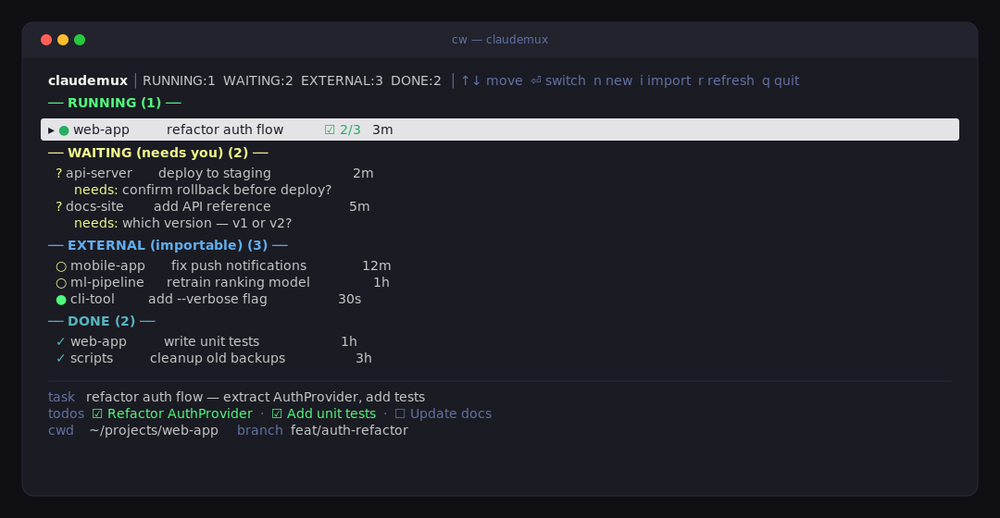

# claudemux

> A tmux-native dashboard for your many Claude Code sessions. See every running
> Claude at a glance, switch between them in one keystroke, and never lose track
> of which project is waiting on you.



`claudemux` (command: `cw`) gathers every Claude Code session you have running
into one tmux session and adds a small curses board on top. The board reads
Claude's own session registry and transcripts, so it knows which session is
busy, which is idle, which is blocked asking you a question, and which is done —
and lets you jump straight into the right terminal without ever leaving tmux.

## Why

Run more than one Claude at a time and you quickly lose track: *which terminal
was the API server, which one is waiting for me to confirm, which one already
finished?* `claudemux` turns that chaos into a single screen — and the terminal
stays front and center, because the terminal is where the real work happens.

## Features

- **One-screen overview** — every live Claude session, grouped by status.
- **"Waiting (needs you)"** — surfaces sessions blocked on a question, with the
  actual question shown inline. This is the painkiller.
- **Instant switching** — select a card, land in that real terminal. No new
  windows, no web page, no context switch.
- **Import existing sessions** — `claude --resume <sid>` pulls a bare-terminal
  session into tmux without losing the conversation history.
- **Launch new ones** — pick a project, optional first prompt, done.
- **Live status** — busy/idle, current task, todo progress (`TodoWrite`), last
  message, git branch, age — all read from the transcript.
- **Zero dependencies** — pure Python 3 stdlib + tmux. No pip, no npm.

## Requirements

- macOS or Linux
- tmux ≥ 3.2 (for `display-popup`)
- Python 3.8+
- Claude Code CLI (`claude`) on your PATH

## Install

```sh
git clone https://github.com/askxiaozhang/claudemux.git
cd claudemux
chmod +x cw.py
echo "alias cw='python3 $PWD/cw.py'" >> ~/.zshrc   # or ~/.bashrc
```

## Quick start

```sh
cw up        # create/attach the tmux session and bind the hotkeys
```

Then, anywhere inside tmux:

- `Ctrl-b b` — summon the board (popup overlay)
- `Ctrl-b N` — new Claude in a project (prompts for cwd)

## The board

| Key | Action |
|---|---|
| `↑` `↓` / `j` `k` | move selection |
| `Enter` | managed card → switch to that terminal · external card → import (`--resume`) and switch |
| `n` | new Claude session (cwd + optional prompt) |
| `i` | import the selected external session |
| `r` | refresh |
| `q` | close the board |

Cards are grouped:

- **Running** — busy interactive sessions and running background agents
- **Waiting (needs you)** — idle sessions and blocked background agents (the
  question is shown)
- **External (importable)** — Claude sessions in a bare terminal, not yet in tmux
- **Done** — completed background agents

The selected card's detail panel shows cwd, the full current task, todo list,
last message, and git branch.

## Commands

```
cw                         create/attach tmux session + bind keys (default)
cw up                      same as above
cw board                   run the board TUI directly
cw launch <cwd> [prompt]   open a new Claude window in <cwd>
cw import <sid>            import an existing session via claude --resume
cw list                    print the board as plain text (no TUI)
cw status                  print discovered sessions/jobs as JSON
```

## How it works

`claudemux` only **reads** files Claude already writes — it doesn't patch or
wrap the CLI:

| Source | Read for |
|---|---|
| `sessions/<pid>.json` | live interactive sessions: pid, sessionId, cwd, busy/idle |
| `jobs/<id>/state.json` | background agents: state, the question it's blocked on, tokens |
| `projects/*/<sid>.jsonl` (tail) | session title, current task, last message, `TodoWrite` progress, git branch |
| `.claude.json` | known projects |

It scans `~/.claude` and `~/.claude-doubao` and dedupes by `sessionId`. tmux
windows are named `<project>-<sid8>`; the board uses that 8-char suffix to tell
switchable (in-tmux) sessions apart from external (bare-terminal) ones — no
process-tree walking required.

```
   ┌─────────────── tmux session "cw" ───────────────┐
   │  win: api-server-3a305475  → claude (busy)       │
   │  win: web-app-0702e324     → claude (idle)       │
   │  win: docs-4966e175        → claude --resume ...  │
   │  ...                                              │
   │   ▲ Ctrl-b b pops up the board over whichever     │
   │     terminal you're in; pick a card → switch      │
   └───────────────────────────────────────────────────┘
```

## Limitations

- **You can't attach to a bare terminal retroactively.** macOS (SIP) and tmux
  only let you manage sessions they started. Sessions already running in a plain
  terminal appear under **External** and are imported via `claude --resume`,
  which continues the conversation in a fresh tmux window.
- **After importing, close the old terminal.** `--resume` points the new tmux
  process at the same session; two writers can conflict.
- **Replying to blocked background agents from the board** is planned. For now,
  switch to the agent's terminal or use `claude agents`.

## Troubleshooting

- **`Ctrl-b b` does nothing** — re-run `cw up` (it re-binds the key in the tmux
  prefix table). Run `tmux list-keys -T prefix | grep cw.py` to verify.
- **No cards show up** — run `cw list`; if empty, make sure Claude sessions are
  actually running and `~/.claude` (or `~/.claude-doubao`) exists.
- **The popup flashes and closes** — run `python3 cw.py board` directly in a
  terminal to see any traceback.
- **Wrong Claude profile on launch** — `cw launch` inherits your shell
  environment, so `claude` lands on whatever profile your shell uses.

## License

MIT — see [LICENSE](LICENSE).
